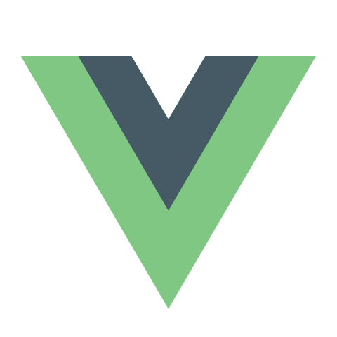

### Hello there 👋

I'm Bojan, a Full-Stack Developer based in Belgrade, who specializes in building (and occasionally designing) websites and applications.

- 🔭 Currently helping early-stage startups kick-off their MVP
- 🌱 On the side, I’m learning about UI & UX Design and Game Development (Unity)
- 📫 Interested in working together? Feel free to reach out to me through my [website](https://bojangabric.com), [email](mailto:bojan@bojangabric.com) or [LinkedIn](https://www.linkedin.com/in/bojangabric)

**Languages and tools I tend to use the most**

 

 

